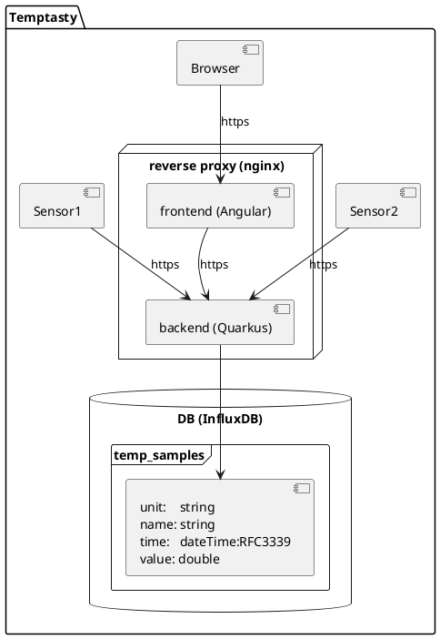

# Temptasty - temperature samples

This docker compose file starts influxdb, a mock temperature sensor, a quarkus application as receiver and an angular
frontend



## Running the application

You must provide an .env file in root folder with following content

```
# InfluxDB Configuration
INFLUXDB_HTTP_PORT=8086
INFLUXDB_INIT_MODE=setup
INFLUXDB_INIT_USERNAME=myuser
INFLUXDB_INIT_PASSWORD=mypassword
INFLUXDB_INIT_ORG=myorg
INFLUXDB_INIT_BUCKET=mybucket
INFLUXDB_INIT_ADMIN_TOKEN=mytoken
INFLUXD_LOG_LEVEL=warn

# Timezone
TZ=Europe/Berlin
```

To build and run the application, be sure to have npx, docker and docker-compose installed.

```
./run.sh
```

## Frontend

To show the frontend, go to https://temptasty.org:8081/sample-viewer

## Backend

To get all samples, call

```
curl -i -X GET 'https://temptasty.org:8081/samples'
```

To get the mean within a range of the last hour, last day, or last month, call

```
curl -i -X GET 'https://temptasty.org:8081/samples/mean?sensor=sensor1&range=h'
```

To view the openapi description go to http://localhost:8080/q/swagger-ui/

## Database

To configure the database, go to http://localhost:8086/


